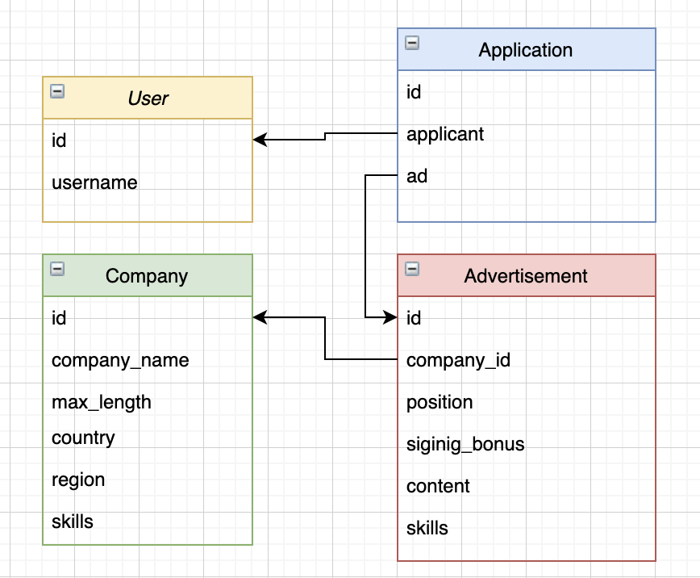

# wanted_pre_onboarding 사전과제

## ❗️ 프로젝트 소개
'원티드'와 같은 사이트에서 필요한 기능들의 api를 개발하였습니다. <br>
기업은 채용공고를 등록하고 관리할 수 있으며, 사용자는 채용공고를 보고 지원할 수 있습니다. (사용자 인증절차는 생략하였습니다.)<br>

## ❗️ 사용한 기술
- Django
- DRF
- sqlite3
- Git

## 👇 ERD

(User 모델은 Django의 기본 User 모델을 사용했습니다. )

## 👇 기능 및 api 명세서
- 채용공고 등록
```
Http method: POST

<url>
'/recruit/'

<input>
{
    'company_id': 3,
    'position': 'backend engineer',
    'signing_bonus': 1000000,
    'content': 'We are recruiting...',
    'skills': 'python',
}

<output>
status_code = 201
output은 input과 동일
```
- 채용공고 수정
```
Http method: PATCH

<url>
'/recruit/<int:advertisement_id>/'

<input>
{
    'skills': 'Django',
}

<output>
status_code = 200
{
    'company_id': 3,
    'position': 'backend engineer',
    'signing_bonus': 1000000,
    'content': 'We are recruiting...',
    'skills': 'Django', #변경됨
}
```
- 채용공고 삭제
```
Http method: DELETE

<url>
'/recruit/<advertisement_id>/'

<input>
없음

<output>
status_code = 204
```
- 채용공고 목록 조회
```
Http method: GET

<url>
'/recruit/'

<input>
없읍

<output>
status_code = 200
[
    {
        "id": 1,
        "company_name": "원티드랩",
        "country": "대한민국",
        "region": "서울",
        "position": "백엔드 주니어 개발자",
        "signing_bonus": 1000000,
        "skills": "python, Django"
    },
    {
        "id": 2,
        "company_name": "큐피스트",
        "country": "대한민국",
        "region": "서울",
        "position": "백엔드 주니어 개발",
        "signing_bonus": 1000000,
        "skills": "python, Django, Flask"
    },
    ...
]
```
- 채용공고 검색(회사명과 포지션으로 검색 가능)
```
Http method: GET

<url>
'/recruit/?&position=백엔드'

<input>
없음

<output>
status_code = 200
[
    {
        "id": 1,
        "company_name": "원티드랩",
        "country": "대한민국",
        "region": "서울",
        "position": "백엔드 주니어 개발자",
        "signing_bonus": 1000000,
        "skills": "python, Django"
    },
    {
        "id": 2,
        "company_name": "큐피스트",
        "country": "대한민국",
        "region": "서울",
        "position": "백엔드 주니어 개발",
        "signing_bonus": 1000000,
        "skills": "python, Django, Flask"
    },
]
```
- 채용 상세 페이지 조회
```
Http method: GET

<url>
'/recruit/<int:advertisement_id>/'

<input>
없음

<output>
status_code = 200
{
    "id": 8,
    "company_name": "큐피스트",
    "country": "대한민국",
    "region": "서울",
    "other_ads": [
        2,
        4
    ],
    "position": "백엔드 개발자(경력)",
    "signing_bonus": 250000,
    "content": "경력 2년 이상의 백엔드 개발자를 모집합니다.",
    "skills": "python, Django, Flask"
}
```
- 채용공고 지원
```
Http method: POST

<url>
'/application/'

<input>
{
    'applicant': 2, #user_id
    'ad': 3, #advertisement_id
}

<output>
status_code = 201
output은 input과 동일
```